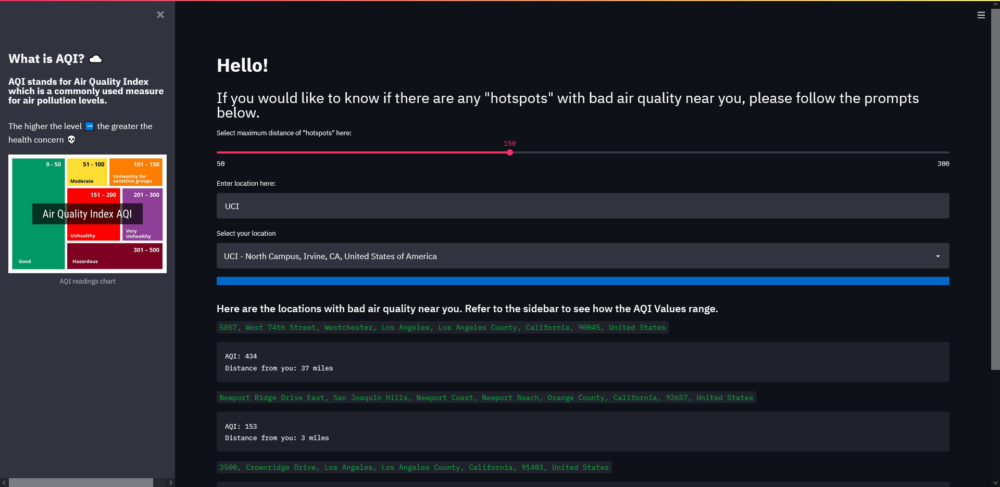
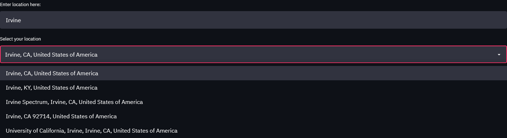

# Air-App

<!--
*** Thanks for checking out the Best-README-Template. If you have a suggestion
*** that would make this better, please fork the repo and create a pull request
*** or simply open an issue with the tag "enhancement".
*** Don't forget to give the project a star!
*** Thanks again! Now go create something AMAZING! :D
-->

<!-- PROJECT SHIELDS -->
<!--
*** I'm using markdown "reference style" links for readability.
*** Reference links are enclosed in brackets [ ] instead of parentheses ( ).
*** See the bottom of this document for the declaration of the reference variables
*** for contributors-url, forks-url, etc. This is an optional, concise syntax you may use.
*** https://www.markdownguide.org/basic-syntax/#reference-style-links
-->
<!-- [![LinkedIn][linkedin-shield]][https://www.linkedin.com/in/venkatkandhipati] -->

<!-- PROJECT LOGO -->
 

  

<h1 align="center">Air Quality Checker</h1>

<!--   

    project_description
     
    <a href="https://github.com/github_username/repo_name"><strong>Explore the docs »</strong></a>
     
     
    <a href="https://github.com/github_username/repo_name">View Demo</a>
    ·
    <a href="https://github.com/github_username/repo_name/issues">Report Bug</a>
    ·
    <a href="https://github.com/github_username/repo_name/issues">Request Feature</a>
  
 -->

<!-- TABLE OF CONTENTS -->

  
Table of Contents

  <ol>
    <li>
      <a href="#about-the-project">About The Project</a>
      <ul>
        <li><a href="#built-with">Built With</a></li>
      </ul>
    </li>
    <li>
      <a href="#getting-started">Getting Started</a>
    </li>
<!--     <li><a href="#usage">Usage</a></li>
    <li><a href="#roadmap">Roadmap</a></li>
    <li><a href="#contributing">Contributing</a></li>
    <li><a href="#license">License</a></li>
    <li><a href="#contact">Contact</a></li>
    <li><a href="#acknowledgments">Acknowledgments</a></li> -->
  </ol>

<!-- ABOUT THE PROJECT -->
## About The Project

Users can visit this application to find locations near them with bad air quality, measured in the AQI scale.

A radius slider allows for users to select the range of their search.

The search box is where users can enter their address (or general location) which will then populate the below drop down menu with the autocompleted locations they might be referring to.

A progress bar will then show the time it takes for the application to display the results to the user.

(<a href="#top">back to top</a>)

### Built With

* [Python](https://www.python.org/)
* [Streamlit](https://streamlit.io/)
* [Heroku](https://streamlit.io/)
* [Purple Air API](https://api.purpleair.com/)
* [Geoapify Location Autocomplete API](https://www.geoapify.com/address-autocomplete)

(<a href="#top">back to top</a>)

<!-- GETTING STARTED -->
## Getting Started

Visit the [application](https://aqichecker.herokuapp.com/) here.

<!-- CONTACT -->
## Contact

Venkat Kandhipati - kandhipati.venkat@gmail.com

<!-- Project Link: [https://github.com/github_username/repo_name](https://github.com/github_username/repo_name) -->

(<a href="#top">back to top</a>)

